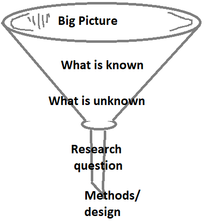

# Introduction Section

<iframe width="560" height="315" src="https://www.youtube.com/embed/18NFP61HM4g" title="YouTube video player" frameborder="0" allow="accelerometer; autoplay; clipboard-write; encrypted-media; gyroscope; picture-in-picture" allowfullscreen></iframe>

A scientific research paper generally follows the format of IMRaD (Introduction, Methods, Results and Discussion). The introduction section sets the stage for the entire paper and introduces the topic of interest to the audience. This first section provides a broad context of the issue under investigation, summarizes what is known and unknown, and tries to convince the readers that this particular study will be a valuable addition to current knowledge.

There are several guidelines suggesting how to best structure the introduction section for a research paper [@cals2013effective;@bahadoran2018principles;@heard2016scientist, p.84-88]. Typically, a well-written introduction section will contain broader background information on the topic, a summary of key existing knowledge relevant to the specific problem, the gap in the current knowledge (rationale), and the research question and/or the hypothesis. Though not essential, some authors may opt to briefly describe the study design and methods.

## Funnel shape

To better organize the main components of the introduction, it may be useful to build an outline or a skeleton of the section. One approach could be adopting a “funnel shape” or an inverted pyramid shape to organize the components. Based on the funnel shape, the introduction section has five key elements going from broad to narrow: big picture, what is known, what is unknown, research question and methods/design (see Figure 1).

```{r funnel, echo=FALSE, fig.align="center", out.width="25%", fig.cap = 'The typical funnel shape of an Introduction section.'}
# \@ref(fig:funnel)

```


1. **Big picture**: the introduction starts with the big picture, represented by the broad opening of the funnel shape. The big picture introduces the general context of the research area and provides an overview of “why this topic or issue is important.” For a research paper in population and public health, it is a good idea to present the broader background information on the health-related topic. This may include the magnitude of the problem and/or the burden of disease (e.g., incidence, prevalence or cost). The big picture should provide the audience with an understanding of the study outcome or explanatory variable from a public health perspective.

2. **What is known**: from the big picture, the author narrows down to a more specific research area under investigation. This part should outline the existing knowledge of the research area by providing a summary of the evidence, including the landmark and recent studies. This summary should cite the most current and comprehensive knowledge on the subject. Remember that the evidence cited should be directly relevant to your specific study and inform your research question. These summaries should focus on the particular exposure or disease of interest (e.g., intervention or outcome elements of the PICOT framework) [@thabane2009posing].

3.	**What is unknown**: as the funnel further narrows, this part should present a synthesis of the reasons why the issue is important (in the big picture), what is already known, and what is unknown, to convince the audience that there is a need to conduct your specific study. This part can include the gaps in current knowledge, any inconsistencies in the literature, gaps in the methodology or the need for different or better methodology. When describing what is unknown, the author should highlight the importance of conducting the present study and persuade the readers that this analysis was needed (rationale). Who would likely benefit from this study should also be highlighted. For example, if there is a previous study that answered the same research question, a clear and compelling argument on the need for the updated study should be included.

4.	**Research question**: following the identification of the gap in current knowledge, this part outlines the specific purpose of the study. It should include the study objective and/or hypothesis that will address the identified gap in current knowledge. 

5.	**Methods/design**: as the last stage of the funnel, this part can briefly introduce the approach used to answer the research question. This can include the study design or methods, however, a brief summary is sufficient as the methodological approach will be described in depth in the methods section.

## Examples

### Example 1

The first example is taken from @nisingizwe2020perceived. You can download the open access PDF from [here](https://bmcpregnancychildbirth.biomedcentral.com/track/pdf/10.1186/s12884-020-2775-8.pdf). 

```{r example1, echo=FALSE, message=FALSE, warnings=FALSE, results='asis'}
tabl <- '
Table 1: A study about the association between perceived barriers to health care access and inadequate antenatal care visits [@nisingizwe2020perceived]

| Elements      |  Location in the introduction section   | Comments |
| --- | :---: |:----------- |
| Big picture   | 1st paragraph (*"Maternal and neonatal mortality ..."*)  |  Authors introduce the public health problem of interest, maternal and neonatal mortality, by presenting the magnitude of the problem and the burden of disease. This paragraph highlights the importance of the public health problem. |  
| What is known   |   2nd paragraph (*"Timely and frequency of ANC ..."*)     |   The authors describe the more specific research area: the relationship between receiving adequate antenatal care (ANC) and barriers to healthcare.       |
|    |  3rd paragraph (*"However, the country’ maternal and neonatal death rates  ..."*)      |  The authors provide a summary of the existing knowledge relevant to the study that informs the research question.   |
| What is unknown   |  4th paragraph (*"To date, there is a paucity ..."*)      |  The authors present what is unknown: the relationship between perceived barriers to health care and inadequate ANC visits in Rwanda. In addition, they identify previous studies and the gaps in the current knowledge. The clear identification of a research gap supports the stated rationale for conducting this particular study.      |
| Research question   |  4th paragraph (*"Therefore, this study aims ..."*)      |   Following the identification of the gap in current knowledge, the authors present the specific purpose of the study.        |
|    |  5th paragraph (*"We hypothesized that  ..."*)      |   The authors present the hypothesis for the research question.       |
|    |  5th paragraph (*"This study will contribute to  ..."*)      |   the authors include a brief summary of the key study implications to convince the audience that this research paper will add value to the field of study.        |
| Methods/design   |        |     The authors have not included a specific section summarizing the methodological approach used in the study to answer the research question. However, in the 4th paragraph, they indicated that the study will use a “country representative sample” from “2015 DHS data”.      |
'
cat(tabl) # output the table in a format good for HTML/PDF/docx conversion
```

### Example 2

The second example is taken from @basham2019multimorbidity. You can download the open access PDF from [here](https://www.tandfonline.com/doi/epub/10.1080/22423982.2019.1607703). 

```{r example2, echo=FALSE, message=FALSE, warnings=FALSE, results='asis'}
tabl2 <- '
Table 1: A study about prevalence of multimorbidity in northern vs. southern Canada [@basham2019multimorbidity]

| Elements      |  Location in the introduction section   | Comments |
| --- | :---: |:----------- |
| Big picture   | 1st paragraph (*"Multimorbidity is common among  ..."*)  |  The public health problem of interest, multimorbidity, is introduced along with the magnitude of the problem and the burden of disease.  |  
| What is known and unknown  |   2nd paragraph (*"Northern Canada, which  ..."*)  and 3rd paragraph (*"The equivocacy of findings ..."*)   |   The more specific research area, multimorbidity in Canadian provinces and territories, is contextualized. The authors provide a summary of relevant previous studies and highlight the gaps within these studies. The synthesis of the “big picture,” “what is known” and “what is unknown” elements supports the rationale for this particular study.
       |
| Research question   |  3rd paragraph (*"The primary aim of this study ..."*)      |   Once the need for this particular study is identified, the authors present the specific research question and the hypothesis.         |
| Methods/design   |    3rd paragraph (*"This study describes multimorbidity  ..."*)    |     The authors briefly mention the methodological approach used in the study.     |
'
cat(tabl2) # output the table in a format good for HTML/PDF/docx conversion
```


Through these 2 examples, we have looked at the key elements of an introduction section of a scientific article in population and public health research. The introduction section provides the general context of the topic (big picture), the narrower research area and what is known, the gap in the existing knowledge, the specific purpose of the study and a summary of the methods and design.

### Importance of a 'hook'

As the author and researcher, you have the knowledge of the “whole story” of your study from start to end. Hence, you can write the introduction strategically. The introduction section introduces the public health problem to the audience and tries to capture their interest to continue reading. In a newspaper or magazine article, the writer aims to grab the readers’ attention with a “hook” at the beginning. In a scientific article, although you don’t necessarily want to give out all the findings and study implications initially, you should utilize the introduction section to incite the readers’ and reviewers’ interest. By clearly outlining the key components, the introduction section should convince the audience that the population/public health issue under investigation is critical to address and that your particular study is novel and valuable.

## Common pitfalls

- Common pitfalls in the introduction section include *incomplete, inaccurate or outdated reviews of the literature* on the topic. For example, including literature that is tangentially related or within the same field but not directly related to the problem, may result in an incomplete or confusing review of the background knowledge. Including inadequate, incomplete or outdated information may result in the rejection of the paper.
- Not adequately explaining the *importance or the relevance of the current knowledge in relation to the study aims* is another pitfall. This can lead to an introduction section that is less effective in communicating the relevancy and novelty of your study.

## Tips

1.	Arguably, incorporating *clear study aim(s)* and *rationales for the study objectives* are the most important aspects of the introduction section. (i) Aims should be clearly articulated, and the design of the study should be planned accordingly. (ii) Take time to think about the justification of the current study.
2.	Provide only the *key references* that are needed to describe the background knowledge, as well as what is known and unknown about the topic of interest. Including an excessive amount of literature in the introduction can be distracting. Be mindful that you will have an opportunity to contextualize your research in the literature by comparing your findings with other studies in the Discussion section. The introduction should be focused on setting the tone for what is coming next.
3.	A lengthy introduction can also make the readers lose interest. A general suggestion is that the introduction section should be about 10-15% of the whole paper [@cals2013effective].
4.	If you already have a general idea of the journals that you would like to submit your article to, the introduction can be tailored to the audience of the target journal. For example, if you are interested in submitting to journals with a heavier focus on methodology or epidemiology, you may want to highlight the novelties in the design or methods. If you are interested in submitting to clinician-focused or subject-specific journals, you may emphasize the clinical or public health implications of the study.


